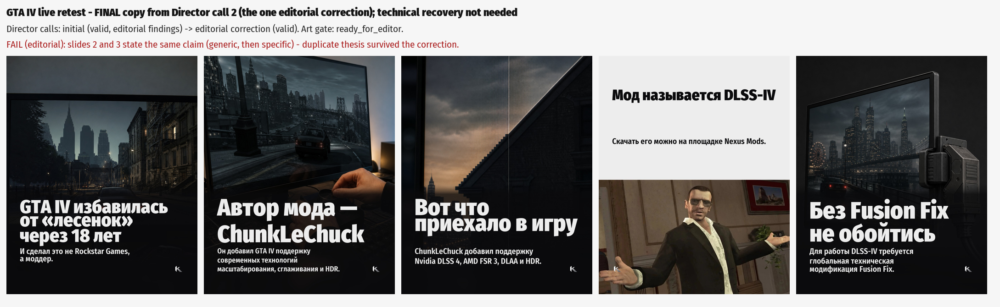

# Director structured-output stability - founder review

## Offline

- schema worst case (every field at maxLength, 10 slides): 200,746 JSON chars; unbounded: $.evidence_used[], $.visual_rhythm.interruption_slides[]
- measured: 36 valid responses, max 11039 output tokens (9-slide recap), max reasoning 1887, all-in max per slide 1,227 tokens
- cap = ceil(1.25 x 1,227 x max slides): viral 10,737 / recap(9) 13,804 / carousel(10) 15,338 / single-reel 4,000

## Live retest - same GTA IV story (3DNews)

- Phase A: **single** (REACTION) -> viral rule -> carousel
- provider requests:
  - PHASE_A: OK, finish=stop, out=814/8000, $0.007323
  - DIRECTOR: PROVIDER_ERROR - ProviderTransientError: openai: APIConnectionError: Connection error., finish=None, out=None/10737, $0
  - DIRECTOR: OK, finish=stop, out=8570/10737, $0.064268
  - DIRECTOR: OK, finish=stop, out=6710/10737, $0.05332
  - (the DIRECTOR PROVIDER_ERROR is an APIConnectionError at $0 that the gateway's existing transient-error handling re-issued; it is not a pipeline Director call)
- Director call trace: [{"call": 1, "stage": "initial", "result": "editorial_findings"}, {"call": 2, "stage": "editorial_correction", "findings": "editorial correction required: slide 3 body is a list of product names, not Russian prose: 'В наборе — Nvidia DLSS 4, AMD FSR 3, DLAA и HDR.' - say it as a sentence; [advisory] card_adds_no_new_information (card 6): only 1 of 5 content words are new - the card restates earlier cards - a viral slide's body must add a new grounded fact", "result": "valid"}]

## Call 1 - INITIAL Director output (technically valid; technical recovery NOT fired)

| # | headline | body |
|---|---|---|
| 1 | 18 лет спустя GTA IV избавилась от «лесенок» | Полноценное сглаживание добавил моддер, а не Rockstar Games. |
| 2 | Rockstar тут ни при чём | Полноценное сглаживание появилось в PC-версии GTA IV не благодаря усилиям Rockstar Games. |
| 3 | Мод добавил больше, чем сглаживание | В наборе — Nvidia DLSS 4, AMD FSR 3, DLAA и HDR. |
| 4 | Мод называется DLSS-IV | Он доступен для скачивания на Nexus Mods. |
| 5 | Но нужен Fusion Fix | Для работы DLSS-IV требуется глобальная техническая модификация Fusion Fix. |
| 6 | Сглаживание приехало. Через мод. | DLSS-IV уже доступен на Nexus Mods. Для работы нужен Fusion Fix. |

Caption: GTA IV получила полноценное сглаживание спустя почти два десятка лет — и Rockstar Games тут ни при чём. Мод DLSS-IV от ChunkLeChuck добавляет Nvidia DLSS 4, AMD FSR 3, DLAA и HDR. Скачать его можно на Nexus Mods, но для работы потребуется Fusion Fix.

## Editorial findings sent back (the ONE editorial correction)

editorial correction required: slide 3 body is a list of product names, not Russian prose: 'В наборе — Nvidia DLSS 4, AMD FSR 3, DLAA и HDR.' - say it as a sentence; [advisory] card_adds_no_new_information (card 6): only 1 of 5 content words are new - the card restates earlier cards - a viral slide's body must add a new grounded fact

## Call 2 - EDITORIAL CORRECTION output (final, rendered)

| # | headline | body |
|---|---|---|
| 1 | GTA IV избавилась от «лесенок» через 18 лет | И сделал это не Rockstar Games, а моддер. |
| 2 | Автор мода — ChunkLeChuck | Он добавил GTA IV поддержку современных технологий масштабирования, сглаживания и HDR. |
| 3 | Вот что приехало в игру | ChunkLeChuck добавил поддержку Nvidia DLSS 4, AMD FSR 3, DLAA и HDR. |
| 4 | Мод называется DLSS-IV | Скачать его можно на площадке Nexus Mods. |
| 5 | Без Fusion Fix не обойтись | Для работы DLSS-IV требуется глобальная техническая модификация Fusion Fix. |

Caption: Спустя почти 18 лет PC-версия GTA IV получила полноценное сглаживание — благодаря моду DLSS-IV от ChunkLeChuck, а не усилиям Rockstar Games. В наборе — Nvidia DLSS 4, AMD FSR 3, DLAA и HDR. Перед установкой учти главное: для работы мода требуется Fusion Fix.

## Founder checklist (final copy)

| criterion | result |
|---|---|
| complete structured output, inside cap, no runaway | PASS (8,570 and 6,710 of 10,737) |
| hook concrete, strongest fact first | PASS - «GTA IV избавилась от «лесенок» через 18 лет» / «И сделал это не Rockstar Games, а моддер.» |
| natural Russian | PASS with notes - «Вот что приехало в игру» is a teaser label; «глобальная техническая модификация» is lifted wording |
| no product-name list as copy | PASS on slides (caption keeps «В наборе — …») |
| every slide a distinct beat | **FAIL** - slides 2 and 3 state the same claim (generic, then specific) from the same evidence item |
| humour from the fact, max one payoff | PASS |
| grounding | PASS (E1, E5, E6, E7) |
| art gate | ready_for_editor |

**First divergence: EDITORIAL** - the duplicate slide 2/3 thesis survived the one correction (the deterministic redundancy rule did not catch it because slide 3 adds product names).

