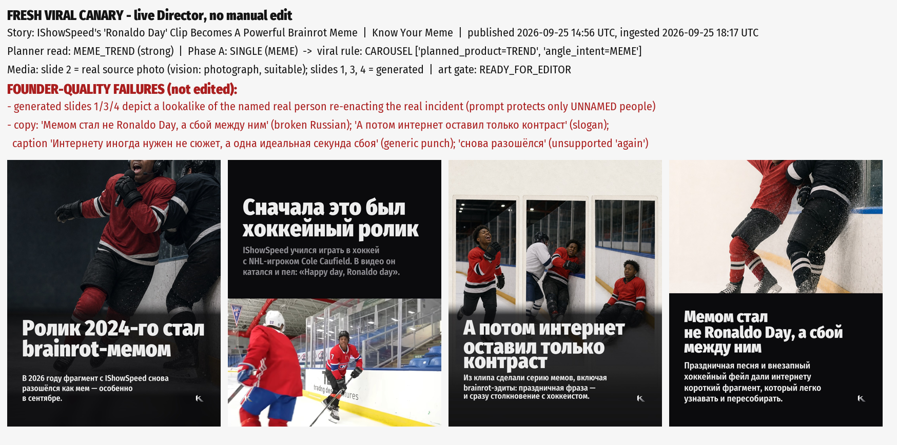

# Fresh viral canary - live Director voice proof (no manual edit)

- **Story:** IShowSpeed's 'Ronaldo Day' Clip Becomes A Powerful Brainrot Meme
- **Source:** Know Your Meme - https://knowyourmeme.com/memes/happy-day-ronaldo-day
- **Published:** 2026-09-25 14:56:52+00:00 · **Ingested:** 2026-09-25 18:17:21.259785+00:00
- **Planner read:** {'format': 'meme_trend', 'strong': True, 'kinds': ['oddity', 'tech', 'culture_source'], 'reason': 'a strange / funny tech or internet-culture premise'}
- **Phase A:** recommended **single**, intent MEME, type NEWS_X_TREND - Доступное исходное изображение и один сильный визуальный контраст позволяют собрать самодостаточный мемный пост без перегрузки объяснениями.
- **Viral routing:** upgraded to **carousel** - ['planned_product=TREND', 'angle_intent=MEME']
- **Gate:** ready_for_editor (recorded_ready_for_editor_no_telegram)

## Live Director copy (verbatim)

| # | role | media | headline | body |
|---|---|---|---|---|
| 1 | hook | generated | Ролик 2024-го стал brainrot-мемом | В 2026 году фрагмент с IShowSpeed снова разошёлся как мем — особенно в сентябре. |
| 2 | context | source | Сначала это был хоккейный ролик | IShowSpeed учился играть в хоккей с NHL-игроком Cole Caufield. В видео он катался и пел: «Happy day, Ronaldo day». |
| 3 | evidence | generated | А потом интернет оставил только контраст | Из клипа сделали серию мемов, включая brainrot-эдиты: праздничная фраза — и сразу столкновение с хоккеистом. |
| 4 | takeaway | generated | Мемом стал не Ronaldo Day, а сбой между ним | Праздничная песня и внезапный хоккейный фейл дали интернету короткий фрагмент, который легко узнавать и пересобирать. |

**Caption:**

Старый хоккейный ролик IShowSpeed внезапно получил вторую жизнь в 2026 году.

В исходном видео он учится играть с NHL-игроком Cole Caufield, поёт «Happy day, Ronaldo day» — и тут же улетает в борт после столкновения.

Именно этот контраст и превратил фрагмент в материал для серии мемов и brainrot-эдитов. Интернету иногда нужен не сюжет, а одна идеальная секунда сбоя.

