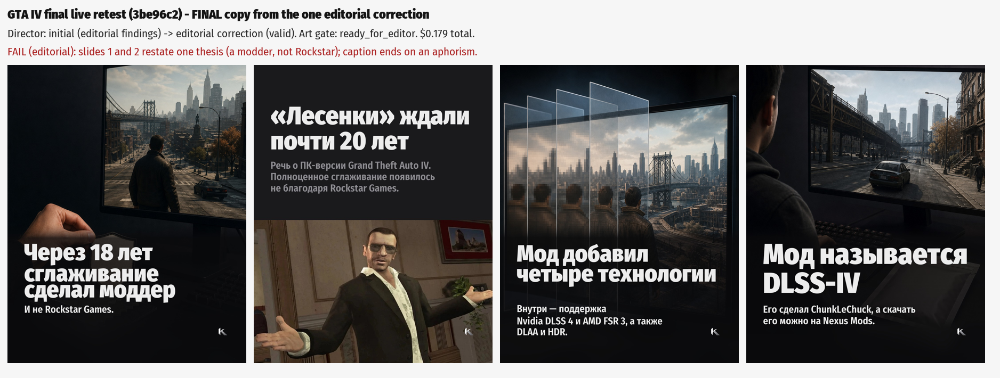

# Thesis-level slide uniqueness + caption copy - founder review

## Offline acceptance (0 provider calls) on the exact final GTA output of 72d4a52

- 1_slides_2_3_subsumption_detected: PASS
- 2_explanation_says_specificity_not_new_beat: PASS
- 3_caption_list_repetition_detected: PASS
- 4_teaser_label_surfaced: PASS
- 5_deepseek_passes: PASS
- 6_hamster_passes: PASS
- 7_same_evidence_item_different_facts_pass: PASS
- 8_different_evidence_ids_same_thesis_fail: PASS
- 9_no_story_specific_terms_in_rule_code: PASS
- 10_only_one_editorial_correction: PASS

## Live retest - same GTA IV story (event 30740b23), commit 3be96c2

- provider calls:
  - PHASE_A: OK, finish=stop, out=1021/8000, $0.008571
  - VISION: OK, finish=stop, out=55/400, $0.0012
  - DIRECTOR: OK, finish=stop, out=6318/10737, $0.050837
  - DIRECTOR: OK, finish=stop, out=6286/10737, $0.050822
  - images: 3 x gpt-image ($0.0679625)
- Director call trace: [{"call": 1, "stage": "initial", "result": "editorial_findings"}, {"call": 2, "stage": "editorial_correction", "findings": "editorial correction required: CreativeLanguageError: clearly English audience-facing field for locale=ru; slide 3 body is a list of product names, not Russian prose: 'Nvidia DLSS 4, AMD FSR 3, DLAA и HDR.' - say it as a sentence", "result": "valid"}]

## Call 1 - initial Director output

| # | ev | headline | body |
|---|---|---|---|
| 1 | E1 | В GTA IV убрали «лесенки» спустя 18 лет | И сделал это моддер, а не Rockstar Games. |
| 2 | E2 | Полноценное сглаживание добавил моддер | Улучшение пришло не благодаря усилиям Rockstar Games. |
| 3 | E6 | DLSS-IV добавляет четыре технологии | Nvidia DLSS 4, AMD FSR 3, DLAA и HDR. |
| 4 | E7 | Мод называется DLSS-IV | Его можно скачать на Nexus Mods. Почти 18 лет спустя — и без Rockstar. |

Caption: ПК-версия GTA IV получила полноценное сглаживание почти через 18 лет после выхода — не от Rockstar Games, а благодаря моддеру ChunkLeChuck. Мод DLSS-IV добавляет DLSS 4, FSR 3, DLAA и HDR и уже доступен на Nexus Mods.

## Call 2 - editorial correction (final, rendered)

| # | ev | headline | body |
|---|---|---|---|
| 1 | E1 | Через 18 лет сглаживание сделал моддер | И не Rockstar Games. |
| 2 | E2 | «Лесенки» ждали почти 20 лет | Речь о ПК-версии Grand Theft Auto IV. Полноценное сглаживание появилось не благодаря Rockstar Games. |
| 3 | E6 | Мод добавил четыре технологии | Внутри — поддержка Nvidia DLSS 4 и AMD FSR 3, а также DLAA и HDR. |
| 4 | E7 | Мод называется DLSS-IV | Его сделал ChunkLeChuck, а скачать его можно на Nexus Mods. |

Caption: ПК-версия GTA IV почти 18 лет жила с «лесенками», а полноценное сглаживание ей в итоге добавил моддер ChunkLeChuck. DLSS-IV расширяет игру современными технологиями обработки изображения и уже доступен на Nexus Mods. Иногда патч для старой игры приходит совсем не от тех, кто её выпустил.

## Verdict: FAIL (editorial) - first divergence

**Initial editorial validation, slides 1 -> 2.** Slide 1 body «И сделал это моддер, а не Rockstar Games.»; slide 2 «Полноценное сглаживание добавил моддер / Улучшение пришло не благодаря усилиям Rockstar Games.» - the same thesis (a modder, not Rockstar) in synonyms. The lexical thesis comparison saw 0 shared content stems (сделал/добавил, пришло/улучшение), so no finding was sent; the one correction only fixed the language guard and the product list, and the restatement survived into the final (slide 1 «И не Rockstar Games.» / slide 2 «...появилось не благодаря Rockstar Games.»).

**Also missed:** the final caption's last sentence «Иногда патч для старой игры приходит совсем не от тех, кто её выпустил.» is a second punchline / aphorism (generic_filler did not match). Fixed by the rule: the caption name-list, the teaser label and the lifted source wording are gone.

Per the task: STOP - no tuning, no second live attempt.

