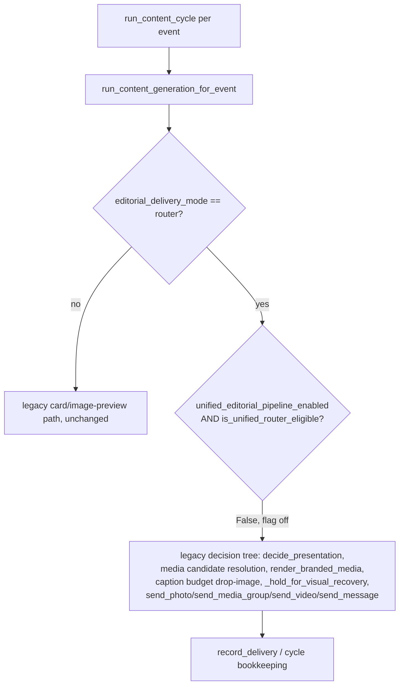

# Flag-off flow (`unified_editorial_pipeline_enabled = False`, the shipped default)

Byte-identical to before this phase — the new `if (...): ... else:` gate at
`worker/content_cycle.py`'s router-mode branch always evaluates its condition to `False` when the
flag is off, so execution falls straight into the `else:` branch, which is the exact,
untouched-except-for-reindentation legacy decision tree.

No new module in this phase (`services/editorial_pipeline/*`, `services/telegram_routing.py`'s
additive `ambiguous` field) is reachable from this path. Proven, not merely argued:
`tests/test_unified_pipeline_shadow_wiring.py::test_flag_off_never_reaches_the_unified_pipeline`
and the full `tests/test_router_media_integration.py` + `tests/test_visual_fallback_hold_repair_1.py`
+ `tests/test_content_worker_cycle.py` suites, re-run unmodified against this branch with
`NEW_FAILURES=0` (the 2 pre-existing failures in `test_router_media_integration.py` are proven
pre-existing via `git stash` against the unmodified base — see the main report §N).
