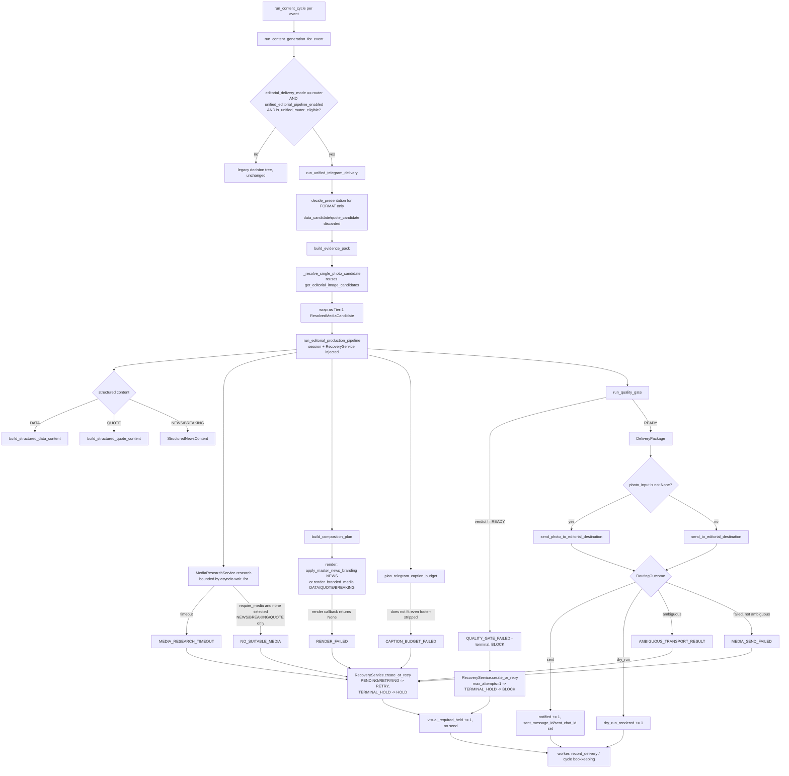

# Flag-on flow (`unified_editorial_pipeline_enabled = True`, real V8-family output)

The single, mutually-exclusive alternative path — never alongside the legacy tree (no shadow call,
no dual-run).

Every recovery reason code (`R1`-`R7`) is a real call site producing a durable `recovery_jobs` row
via `RecoveryService` — proven in `tests/test_unified_pipeline_cutover_authority.py`'s replay tests
(A, D, F, G, H) and `tests/test_unified_pipeline_orchestrator_cutover.py`.
