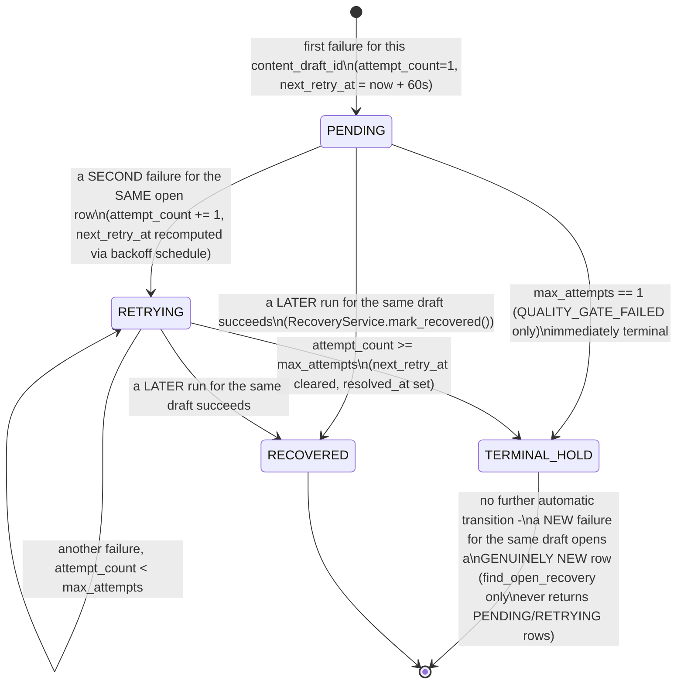

# Recovery state machine (real, durable — `database/models/recovery_job.py` + `services/editorial_pipeline/recovery_service.py`)

Backoff schedule (deterministic, no jitter): attempt 1 → next_retry_at = now + 60s; attempt 2 → +
300s; attempt 3 (and beyond, if `max_attempts` is ever raised past 3) → +900s.

Bounded by construction: `DEFAULT_MAX_ATTEMPTS = 3` for every reason code except
`QUALITY_GATE_FAILED`, which the orchestrator always passes `max_attempts=1` for (a quality/safety
verdict does not change on a blind retry of unchanged content — `_TERMINAL_ONLY_REASON_CODES` in
`orchestrator.py`). No code path anywhere loops or re-invokes `create_or_retry()`/
`run_editorial_production_pipeline()` internally — every transition above is driven by a REAL,
separate failure on a REAL, separate later cycle.

`OrchestratorVerdict` mapping the worker actually sees:

| Recovery state after this call | `OrchestratorVerdict` | Worker action |
|---|---|---|
| `PENDING` / `RETRYING` (not yet exhausted) | `RETRY` | `visual_required_held += 1`, no send this cycle, a future cycle for the same draft may succeed |
| `TERMINAL_HOLD` (bounded retries exhausted) | `HOLD` | `visual_required_held += 1`, needs editor review |
| `TERMINAL_HOLD` via `QUALITY_GATE_FAILED` (always max_attempts=1) | `BLOCK` | `visual_required_held += 1`, content itself must change — never merely retried |
| `DeliveryPackage` produced, transport confirmed `sent=True` | `READY` | `notified += 1`, `sent_message_id`/`sent_chat_id` set |

Persistence proof (`tests/test_unified_pipeline_recovery_service.py::
test_persisted_state_survives_a_fresh_service_instance_after_a_simulated_restart` and
`tests/test_unified_pipeline_cutover_authority.py::
test_recovery_row_created_by_a_real_cycle_is_visible_to_a_fresh_service_instance`): a brand-new
`RecoveryService()` instance, reading the same durable row via a fresh session, sees identical
state to the instance that created it — `RecoveryService` itself holds no in-memory state at all.
