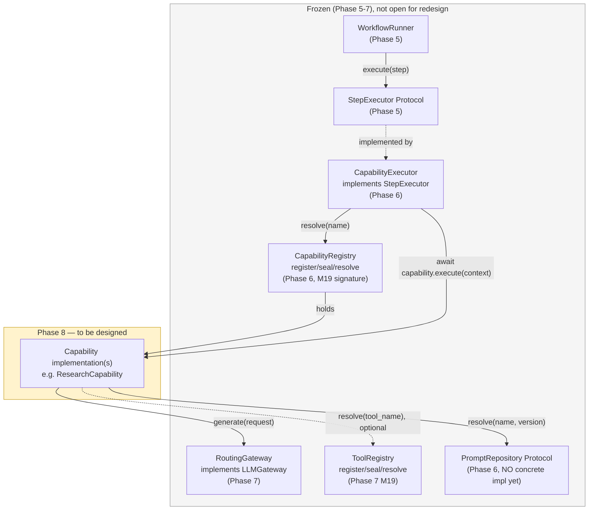
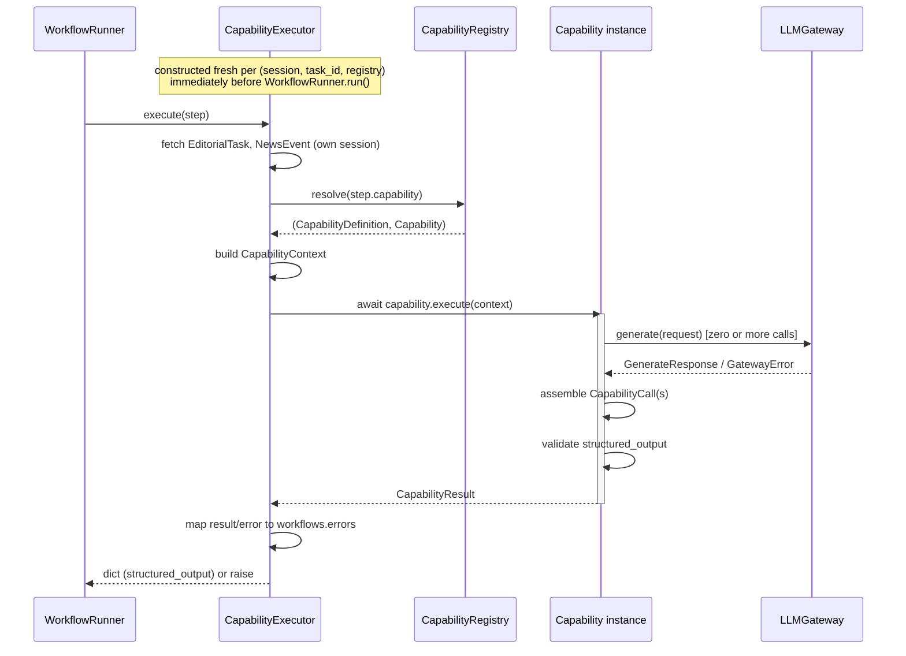
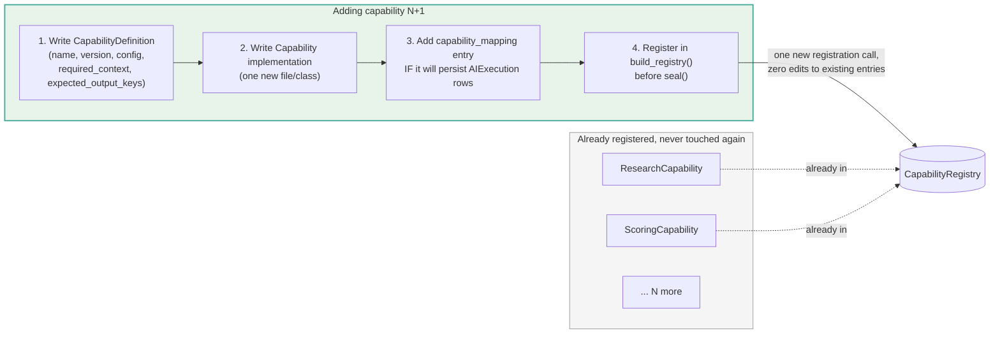

# Phase 8 — Capability Layer Discovery

**Status: exploration document. NOT a specification. NOT binding. Nothing here is frozen.**

This document exists to think through the Capability Layer's design space *before* a Phase 8
Architecture Contract is written — the same discovery step Phase 7 took
(`docs/phase7_ai_integration_layer_planning_v2.md`) before its contract was frozen. Every open
question below is deliberately left open, with advantages, disadvantages, and a recommendation —
not a decision. No code is written or modified in producing this document.

**What is frozen and treated as immutable input:**
- `docs/phase6_architecture_contract.md` — the Capability Framework's original shape (`Capability`,
  `CapabilityContext`, `CapabilityResult`, `CapabilityDefinition`, `CapabilityRegistry`,
  `CapabilityExecutor`, `LLMGateway` Protocol, `PromptRepository` Protocol).
- `docs/phase7_architecture_contract.md` — the AI Integration Layer beneath `LLMGateway`
  (routing, fallback, cache, rate limiting, cost accounting, observability, `ToolRegistry`),
  **including Amendment C**, which changes one load-bearing fact Phase 6 assumed.
- The actual, currently-committed code in `capabilities/`, `schemas/capability*.py`,
  `integrations/prompts/protocol.py`, `integrations/llm_gateway/`, and `workflows/` — not just
  the docs describing it. Every claim below about "what exists today" was checked against the
  real source, not assumed from memory.

**What Phase 8 is actually being asked to design:** the first real `Capability`
implementation(s) — the thing that sits between `CapabilityExecutor` and `LLMGateway`, turns a
`CapabilityContext` into a prompt, a `GenerateRequest`, zero-or-more Gateway calls, and a
validated `CapabilityResult`. Nothing below this line exists in code yet. Everything above it
(Workflow, `CapabilityExecutor`, `LLMGateway`, the whole Phase 7 stack) is finished and off the
table for redesign.

---

## Table of Contents

1. [A load-bearing fact Phase 6 got right and Phase 7 quietly changed](#1-a-load-bearing-fact)
2. [What already exists — the scaffolding Phase 8 builds inside](#2-what-already-exists)
3. [Capability responsibilities](#3-capability-responsibilities)
4. [Lifecycle and execution model](#4-lifecycle-and-execution-model)
5. [Interaction analysis](#5-interaction-analysis)
   - 5.1 [LLM Gateway](#51-llm-gateway)
   - 5.2 [Workflows](#52-workflows)
   - 5.3 [CapabilityRegistry](#53-capabilityregistry)
   - 5.4 [Prompt Repository](#54-prompt-repository)
   - 5.5 [Tool Registry](#55-tool-registry)
   - 5.6 [Cache](#56-cache)
   - 5.7 [Observability](#57-observability)
   - 5.8 [Cost Tracking](#58-cost-tracking)
   - 5.9 [Budget Guard](#59-budget-guard)
   - 5.10 [Validation](#510-validation)
6. [Extension points — adding a capability without touching existing code](#6-extension-points)
7. [Testing strategy](#7-testing-strategy)
8. [Provider neutrality](#8-provider-neutrality)
9. [Multimodal compatibility](#9-multimodal-compatibility)
10. [Open decisions](#10-open-decisions)
11. [Diagrams index](#11-diagrams-index)
12. [Summary: settled vs. open](#12-summary-settled-vs-open)

---

## 1. A load-bearing fact Phase 6 got right and Phase 7 quietly changed

Phase 6 contract §9 draws this as the permanent execution order:

```
Workflow → Capability → BudgetGuard (pre-flight) → LLMGateway → Provider → CostTracker (post-hoc)
```

and §2/§11 both list `BudgetGuard` as one of exactly three things a `Capability` is permitted to
hold as an injected dependency (`LLMGateway`, `PromptRepository`, `BudgetGuard`).

Phase 7's Amendment C (§25) relocates the `BudgetGuard.check()` call site from `Capability` to
the Routing Gateway (`FallbackPolicy`, once per fallback candidate, on a cache miss) and states
plainly: **"`Capability` MUST NOT hold a `BudgetGuard` dependency and MUST NOT call it under any
circumstance."** Per the amendment discipline (§26), this is binding, but it never edits Phase 6
§9's diagram or §2's dependency list in place — those sections still read as if Capability calls
BudgetGuard, because amendments are append-only.

**This matters directly for Phase 8**: `Capability`'s injected dependency set today is
`(LLMGateway, PromptRepository)`, not the three Phase 6 §2 originally listed. This document treats
Amendment C as authoritative (it is later and explicitly overrides §9), and flags every place
below where Phase 6's original text, read literally, would mislead a Phase 8 implementer.

A second, related fact worth surfacing up front: `capabilities.registry.build_registry()`'s
actual, currently-implemented signature (added at Phase 7 M19, to satisfy contract §19 rule 2)
is:

```
build_registry(gateway: LLMGateway, prompt_repository: PromptRepository,
                budget_guard: BudgetGuard, tool_registry: ToolRegistry) -> CapabilityRegistry
```

`budget_guard` is a real, accepted parameter of this function — but per Amendment C, no
`Capability` constructor may actually receive it. This is a genuine, already-documented
inconsistency in the frozen contract text (recorded in `docs/phase7_implementation_log.md`'s M19
entry), not invented for this document. Phase 8 does not get to resolve it by editing the
contract, but it does have to decide what `build_registry()`'s *implementation* does with that
parameter once real capabilities exist — see [Decision D](#decision-d-what-does-build_registry-do-with-budget_guard).

---

## 2. What already exists — the scaffolding Phase 8 builds inside



Concretely, what already exists and is not being redesigned:

| Component | State | Where |
|---|---|---|
| `Capability` Protocol (`async def execute(context) -> result`) | Frozen, one method, unchanged since Phase 6 | `capabilities/registry.py` |
| `CapabilityContext` (`business`/`runtime`/`execution`) | Frozen, `extra="forbid"` | `schemas/capability.py` |
| `CapabilityResult` (`status`, `structured_output`, `calls`, timing, `metadata`, `logs`, `next_context`) | Frozen | `schemas/capability.py` |
| `CapabilityCall` / `CapabilityUsage` | Frozen | `schemas/capability.py` |
| `CapabilityDefinition` / `CapabilityConfig` | Frozen | `schemas/capability_definition.py` |
| `CapabilityRegistry` | Frozen, implemented, currently ships empty-sealed | `capabilities/registry.py` |
| `CapabilityExecutor` | Frozen, implemented and tested (fetches `EditorialTask`/`NewsEvent`, builds `CapabilityContext`, calls `.execute()` once, maps errors) | `capabilities/executor.py` |
| `capabilities.errors` hierarchy | Frozen | `capabilities/errors.py` |
| `resolve_ai_capability()` (name → `AICapability` enum, Amendment A) | Frozen | `capabilities/capability_mapping.py` |
| `LLMGateway` Protocol + `RoutingGateway` | Frozen, fully implemented, 488 passing tests | `integrations/llm_gateway/` |
| `ToolRegistry` / `ToolExecutor` / `ToolExecutionRequest`/`Result` | Frozen shape (§9.1/§9.2), implemented **empty** — no tool registered anywhere yet | `integrations/llm_gateway/tools/registry.py` |
| `PromptRepository` Protocol | Frozen shape, **no concrete implementation exists anywhere** — only test-local fakes | `integrations/prompts/protocol.py` |
| `BudgetGuard` Protocol + `RedisBudgetGuard` | Frozen, implemented, invoked *only* from inside `FallbackPolicy` (Amendment C) | `services/budget_guard.py` |
| `CostTracker` Protocol + `RedisCostTracker` | Frozen, implemented, **not called by anything yet** — `RoutingGateway.generate()` deliberately never calls it | `services/cost_tracker.py` |
| `assemble_ai_integration_layer()` | Frozen, wires every real §18 component through to a `RoutingGateway` + empty `CapabilityRegistry` | `integrations/llm_gateway/boot.py` |

The single most consequential gap for Phase 8: **there is no `PromptRepository` implementation.**
Every existing test uses a five-line in-memory fake. `Capability.execute()` cannot resolve a real
prompt today. Phase 8 either has to design a minimal one, or explicitly scope the first real
Capability(ies) around whatever the fake-repository stopgap looks like — see
[Decision K](#decision-k-what-plays-promptrepository-for-the-first-real-capability).

---

## 3. Capability responsibilities

Restated precisely from Phase 6 §2 (unchanged), with the Amendment C correction folded in:

A `Capability` implementation:

1. **Turns a `CapabilityContext` into zero-or-more `LLMGateway` calls.** It reads
   `context.business`/`context.runtime`/`context.execution`, resolves a prompt (via
   `PromptRepository`), assembles a `GenerateRequest`, and calls `LLMGateway.generate()` (or, once
   built, another Gateway method).
2. **Turns the Gateway's response(s) into a validated `CapabilityResult`.** It assembles one
   `CapabilityCall` per Gateway invocation, validates `structured_output` against the prompt's
   `output_schema` (P10), and returns a `CapabilityResult` whose `calls` list accounts for every
   attempt made — success or failure.
3. **Owns its own retry/validation-correction logic**, strictly bounded to its own execution:
   the structured-output correction retry (§8 rule 3) and, for tool-using capabilities, the
   tool-use loop (§9.3) both live entirely inside one `Capability.execute()` call.
4. **Raises only `CapabilityError` subtypes.** Never a bare `Exception`; never lets a Gateway
   exception (`GatewayError` and its subtypes) cross its own boundary unclassified.
5. **Holds only `LLMGateway` and `PromptRepository`** (per Amendment C — not `BudgetGuard`),
   plus optionally `ToolRegistry` for tool-using capabilities, all injected at construction.

A `Capability` implementation explicitly does **not**:

- Call a provider SDK, directly or transitively (P3, unchanged, mechanically enforced by
  `scripts/validate_architecture.py`'s `capability-isolation` rule).
- Call another `Capability` (P4) — chaining happens only through
  `EditorialTask.workflow.step_results`, read back via
  `CapabilityContext.business.workflow_state`.
- Hold a database session or issue a query (P8).
- Call `BudgetGuard` (Amendment C — a correction to Phase 6 §2/§9's original text).
- Call `CostTracker` (unchanged — `CapabilityExecutor` owns that, and even
  `CapabilityExecutor` doesn't call it yet, per Amendment B).
- Manage caching, rate limiting, routing, or retry-across-providers — all of that is invisible
  machinery inside `RoutingGateway` (Phase 7 P14). A `Capability` observes only a
  `GenerateResponse` or a raised error.
- Return free text as a final answer (P10) — every result is a validated, structured dict.

---

## 4. Lifecycle and execution model



**Construction**: a `Capability` instance is built once, at boot, by `build_registry()`, with its
dependencies injected — never self-constructed, never a per-call object. It is registered into the
sealed `CapabilityRegistry` and resolved by name on every `execute(step)` call. This means a
`Capability` instance is effectively a *long-lived singleton* for the life of the process — it
MUST hold no per-call mutable state (P9/general good practice; also implied by
`CapabilityExecutor`'s own "each call to `execute(step)` is independent" rule, §5).

**Invocation**: `Capability.execute(context)` is called exactly once per `CapabilityExecutor.execute(step)`
call. `CapabilityExecutor` never retries a `Capability` internally — retry, if it happens, is
`WorkflowRunner`'s job, and a retry produces a **fresh** `capability_execution_id`
(`f"{task_id}:{capability_name}:{attempt}"`, `attempt` incremented) and a fresh `execute()` call
with no memory of the prior attempt.

**Statelessness between calls**: a `Capability` MUST behave correctly when invoked fresh — no
instance-level memory of a prior `execute()` call may leak into the next one, whether that next
call is a genuine retry of the same step or an entirely different `EditorialTask`. Everything the
capability needs is either in the injected dependencies (constant across calls) or in the
`CapabilityContext` passed to this specific call.

**Internal timeout**: `WorkflowRunner` already wraps the whole `execute(step)` call in
`asyncio.wait_for(..., timeout=step.timeout_seconds)` (Phase 5, unchanged). A `Capability` MAY
additionally enforce its own, smaller `CapabilityConfig.timeout_seconds` around its internal
Gateway calls, by convention (not mechanically enforced) smaller than the owning step's timeout.

**Termination**: `execute()` returns exactly one `CapabilityResult` with `status` `"SUCCESS"` or
raises exactly one `CapabilityError` subtype. There is no partial/streaming return — this
document's non-goals below inherit Phase 6 §13's list unchanged (no long-running capabilities, no
suspend/resume, no multi-event input).

---

## 5. Interaction analysis

For each subsystem: why it exists, why the *boundary* sits exactly where it sits, and why it
should not sit elsewhere.

### 5.1 LLM Gateway

**Why it exists**: `LLMGateway` is the single ingress for all AI provider traffic (P1). Every
model call in the system — regardless of which Capability makes it — funnels through one Protocol
with one provider-neutral request/response shape.

**Why Capability owns the call, not something else**: only the `Capability` knows *what* to ask
(which prompt, what context to fill it with, whether structured output is required, whether tools
are needed). Nothing upstream of it (`CapabilityExecutor`, `WorkflowRunner`) has that domain
knowledge, and nothing downstream of it (`RoutingGateway` and everything inside Phase 7) is
allowed to have it — P14 states routing/fallback/cache/cost/budget must stay invisible to the
Capability, and symmetrically the Gateway must stay invisible to *what* is being asked, only *how*
to fulfill it. The call site has to live exactly at the seam between "knows what" and "knows how."

**Why it shouldn't move**: pushing prompt assembly into `CapabilityExecutor` would violate P2/P3's
separation (Workflow-facing code would gain AI knowledge) and P7 (typed contracts only — the
`GenerateRequest` shape is exactly the typed contract that exists for this). Pushing it into the
Gateway itself would require the Gateway to understand prompts/schemas, contradicting Phase 6 §7's
explicit "no provider-specific or capability-specific parameter anywhere in this Protocol."

**What actually flows across this boundary today**: `Capability` builds a `GenerateRequest`
(`messages`, `preferred_model`/`preferred_provider` as *advisory* hints, `tools`, `response_mode`,
`response_schema`, and `metadata`) and receives back a `GenerateResponse` or a `GatewayError`
subtype (`ProviderTransientError`, `ProviderPermanentIncompatibleError`,
`ProviderModerationBlockedError`, `AllProvidersFailedError`, `RateLimitExceededError`,
`NoRoutableCandidateError`). Budget exhaustion is visible to `Capability` **only** as
`AllProvidersFailedError(reason="all_candidates_budget_denied")` — verified against the actual
implementation: `FallbackPolicy` catches `capabilities.errors.BudgetExceededError` internally,
per candidate (`except BudgetExceededError: ... continue`), and never re-raises it; that Phase 6
exception type never crosses the Gateway boundary at all, in either direction (see §5.9). None of
the exceptions a `Capability` can actually receive are `CapabilityError` subtypes (by design —
`integrations/llm_gateway/errors.py`'s own docstring: the Gateway boundary must never import
upward into `capabilities/`). **A `Capability` MUST catch and translate every one it can receive
into a `CapabilityError` subtype before it propagates** — this translation table is a real design
surface Phase 8 has to define; see [Decision A](#decision-a-where-does-gateway-error-→-capabilityerror-translation-live).

### 5.2 Workflows

**Why the boundary is `StepExecutor`, not something Capability-shaped**: Phase 5's
`WorkflowRunner` was built with zero knowledge of AI (P2) — `StepExecutor.execute(step) ->
dict[str, Any]` is deliberately provider/AI-agnostic, so a Workflow step could in principle be
satisfied by something that isn't an AI call at all. `CapabilityExecutor` is the one and only
implementation of `StepExecutor` in this system, and it is the sole bridge — a `Capability` never
sees a `WorkflowStepDefinition`, never sees `WorkflowExecutionState` directly, and never calls back
into `WorkflowRunner`.

**Why Capability shouldn't talk to Workflow directly**: this is P2's whole point. If a
`Capability` imported `workflows.*`, every future Workflow change would ripple into every
Capability, and vice versa — exactly the coupling the two-Protocol boundary
(`StepExecutor` on one side, `Capability` on the other, `CapabilityExecutor` translating between
them) exists to prevent.

**The one deliberate exception**: `CapabilityContext.business.workflow_state` — a read-only
`WorkflowExecutionStateSnapshot` (`completed_steps`, `step_results`) — is how a later capability in
a multi-step Workflow reads an earlier capability's output (P4's "capabilities chain only through
persisted state"). This is intentionally the *only* channel; a `Capability` cannot invoke another
`Capability`, cannot read `WorkflowExecutionState` directly from the database, and receives only
the already-filtered, already-successful subset (`step_results` includes only `SUCCESS` steps with
a non-null result — a capability can never accidentally read a failed prior step's partial
garbage).

### 5.3 CapabilityRegistry

**Why it exists**: explicit-registration, sealed-after-boot resolution from a name to a
`(CapabilityDefinition, Capability)` pair (P9 — no dynamic discovery). This is the mechanism that
lets `WorkflowStepDefinition.capability` (a bare string, defined in a Workflow) resolve to a real
object at runtime without either side knowing about the other's existence at import time.

**Why it belongs exactly where it is** (a peer to `ProviderRegistry`/`ModelRegistry`/
`RoutingPolicyRegistry`/`ToolRegistry`, all sealed-after-boot, all `register`/`seal`/`resolve`): P9
is a system-wide discipline, not a Capability-specific one. Every registry in this codebase — five
of them now — follows the identical shape, and `CapabilityRegistry` is not an exception. Its
`resolve()` is deliberately I/O-free and side-effect-free (§6 binding rule) so `CapabilityExecutor`
can call it on every single step execution with zero overhead concern.

**Why it shouldn't be smarter**: it is tempting to imagine a "capability manager" that also handles
health checks, versioning negotiation, or hot-reload. Phase 6 §6 explicitly names and rejects this
scope for the same P9 reason every other registry in this system rejects it — this contract is
"designed to remain correct at 30–50 capabilities without change," and the moment it grows a
second responsibility, it stops being a registry and becomes something that needs its own
contract.

### 5.4 Prompt Repository

**Why it exists**: prompt *content* — system role, rules, output schema — is versioned,
human-authored content, not code. `PromptRepository.resolve(name, version)` is a **pure lookup**
over already-published artifacts; a given `(name, version)` resolves to the same `RenderedPrompt`
forever (P6), which is what makes `CapabilityCall.prompt_version` a trustworthy audit pointer and
what makes prompt regression testing meaningful.

**Why Capability owns filling it in, not PromptRepository**: `RenderedPrompt` gives
`system`/`rules`/`output_schema` — the parts that don't vary per call. `Capability` is the only
thing that has `CapabilityContext` (the news event, workflow state, business/runtime data), so it
is the only thing that can fill the `CONTEXT`/`TASK` blocks and hand the assembled `Message` list
to `LLMGateway`. `PromptRepository` never sees `CapabilityContext` (Phase 6 §8's explicit binding
rule) — if it did, prompt lookup would stop being pure and side-effect-free, and prompt regression
tests would stop being reproducible against production content.

**Why it shouldn't grow a `render(name, context)` convenience method**: this was considered and
rejected implicitly by Phase 6 §8's binding rule ("no mutating method... under any circumstance" —
and while `render()` wouldn't mutate, it would collapse the pure-lookup/context-filling boundary
into one call, making `RenderedPrompt` no longer independently testable/auditable without a real
`CapabilityContext`). Keeping `resolve()` and "fill the template" as two separate steps, owned by
two separate components, is deliberate.

**The gap Phase 8 inherits**: no concrete `PromptRepository` exists. See
[Decision K](#decision-k-what-plays-promptrepository-for-the-first-real-capability).

### 5.5 Tool Registry

**Why it exists**: `ToolRegistry` (§9.1/§9.2, implemented at Phase 7 M19) is a
`name -> (ToolDefinition, ToolExecutor, idempotent)` sealed registry — the same P9 discipline as
every other registry, scoped to tools a Capability may call mid-generation (web search, an
internal API, etc.).

**Why Capability, not CapabilityExecutor or LLMGateway, drives the loop**: §9.3 is explicit —
the tool-use loop (`generate()` with `tools=[...]` → non-empty `tool_calls` → resolve executor from
`ToolRegistry` → execute → append `role="tool"` message → `generate()` again → repeat until
`finish_reason == "stop"` or `MAX_TOOL_ROUNDS`) lives entirely inside `Capability.execute()`, never
in `CapabilityExecutor`. `LLMGateway`/`ProviderAdapter` only ever see `ToolDefinition`/`ToolCall`
as opaque data (§9.1) — they never resolve or execute a tool themselves, because doing so would
require the Gateway to know about `ToolExecutor` implementations, which are business logic, and
P1/P14 forbid the Gateway from knowing anything about what a Capability is trying to accomplish.
`CapabilityExecutor` can't own the loop either — it would need to understand tool-call semantics,
which contradicts its role as a thin, capability-agnostic `StepExecutor` bridge.

**Current state**: the registry itself exists and is fully tested; it is constructed empty and
sealed by `assemble_ai_integration_layer()` today, because no concrete tool exists. Phase 8's first
tool-using capability (if any) is also the first real exercise of `ToolExecutor` and the loop
itself — genuinely new ground, not a gap-fill.

### 5.6 Cache

**Why Capability has (almost) zero awareness of it**: P14 is explicit — caching is "invisible
machinery" that "MUST remain entirely internal to the Routing Gateway." A `Capability` observes
only a `GenerateResponse` (which looks identical whether served from cache or a live provider
call) or a raised error. This is deliberate: if a `Capability` could tell the difference, it might
start writing cache-aware logic, which is exactly the kind of duplicated/leaked responsibility
Phase 7's `CacheCoordinator` exists to prevent.

**The one narrow exception**: `GenerateRequest.metadata["cache_policy"]` (read by
`CacheCoordinator._cache_policy()`, defaulting to `"read_write"` when absent) is an *advisory*
hint a `Capability` may set to opt a specific call out of caching (e.g. a call whose freshness
matters more than its cost). This is the same "extend via metadata, never the frozen schema"
channel used throughout Phase 7 — `Capability` may write to it, but never reads cache state, never
computes a cache key, never calls `CacheStore`/`CacheCoordinator` directly (no legitimate import
path exists for it to do so — `capabilities/` doesn't depend on `integrations.llm_gateway.cache`).

### 5.7 Observability

**Why the id hierarchy matters here specifically**: §16.1's tree —
`trace_id → capability_execution_id → request_id → provider_attempt_id → model_route_id`, with
`tool_call_id` hanging off `capability_execution_id` — exists so a single log line deep inside
`FallbackPolicy` or `OpenAIAdapter` can be traced back to the exact `EditorialTask`, the exact
`Capability.execute()` attempt, and the exact `LLMGateway` call that produced it. `Capability` sits
at the one point in the whole system that has all three of `task_id`, `capability_name`, and
`attempt` (all present on `CapabilityContext.runtime` already) — nothing upstream (`WorkflowRunner`)
or downstream (`RoutingGateway`) has that combination in one place.

**Why Capability, not CapabilityExecutor, threads the ids into the Gateway**: `RoutingGateway`
reads `trace_id`/`capability_execution_id`/`request_id` from `GenerateRequest.metadata`
(`gateway.py`'s `_build_observability_context`), with a fallback to a fresh UUID if any are
absent. If `CapabilityExecutor` set them instead, `Capability` would need a side channel to receive
them (since `CapabilityContext` is frozen and gives no obvious slot) — but `CapabilityContext.runtime`
*already* has everything needed to derive them
(`capability_execution_id = f"{task_id}:{capability_name}:{attempt}"`, exactly matching §16.1's own
derivation formula), so `Capability` can and should derive and set them itself when building each
`GenerateRequest`, with **no schema change required anywhere**.

**The gap**: nothing enforces this today. If a `Capability` omits `metadata["trace_id"]` etc., the
Gateway silently falls back to a random UUID and correlation is lost — not a crash, just
degraded observability. See [Decision C](#decision-c-where-does-capabilitycall-bookkeeping--and-observability-metadata-stamping-live),
which folds this question in alongside `CapabilityCall` bookkeeping — both are "must happen
correctly on every call, with no domain logic" concerns handled by the same call-site wrapper.

### 5.8 Cost Tracking

**Why `Capability` assembles `CapabilityCall` but never calls `CostTracker`**: Phase 6 P8 ("no
component persists what it does not own") plus Amendment B (`CostTracker`'s write path is deferred,
not called by anything in Phase 6/7) together mean: `Capability`'s job stops at producing a
`CapabilityResult.calls: list[CapabilityCall]` — a complete, accurate record of every Gateway
attempt made (including failed ones — `CapabilityCall.status` can be `"FAILED"`). Whether and how
that record eventually becomes a persisted `AIExecution` row is `CapabilityExecutor`'s (and,
eventually, `CostTracker`'s) concern, not `Capability`'s.

**Why this is a strictly one-directional handoff**: `Capability` never reads back "how much have
I spent" — that information, if it existed, would live in `CostTracker`'s ledger, which
`Capability` has no dependency on (Amendment C removed the one path — via `BudgetGuard` — through
which a Capability-adjacent component ever touched spend data). This keeps `Capability` fully
decoupled from the AI Integration Layer's Redis-backed runtime state.

**The gap**: `CostTracker.record()` is not called by anyone yet — not `RoutingGateway` (confirmed,
M17), not `CapabilityExecutor` (confirmed, Amendment B). The moment Phase 8 wants a real spend
ledger, *something* has to call it with a real `CapabilityCall` — and the natural candidate is
`CapabilityExecutor`, once Amendment B is itself revisited (a Phase 8+ or later decision, not
assumed here).

### 5.9 Budget Guard

**Why `Capability` does NOT hold it (Amendment C)**: seed by seed, this is the one place Phase 6's
original design and Phase 7's amendment genuinely disagree, and Amendment C wins (§1 of this
document). The practical effect for Phase 8: **`Capability`'s constructor never receives a
`BudgetGuard`.** A `Capability` simply calls `LLMGateway.generate()`; if the call would exceed
budget, `FallbackPolicy` denies that specific fallback candidate internally (catching
`capabilities.errors.BudgetExceededError` itself — that exception is never seen outside
`FallbackPolicy`, in either direction) and either moves to a cheaper one or, on exhaustion, the
`Capability` receives `AllProvidersFailedError(reason="all_candidates_budget_denied")` as an
ordinary `GatewayError`-flavored failure from `generate()` — same as any other dispatch failure.
This is the one and only externally observable signal of budget exhaustion a `Capability` will
ever see; there is no separate `BudgetExceededError` path to handle.

**Why this is a genuine simplification, not just a relocation**: under the old Phase 6 model, every
`Capability` author had to remember to call `BudgetGuard.check()` before *every* Gateway call, with
an estimate for a model the Capability could only guess at (since routing hadn't happened yet).
Under Amendment C, a `Capability` author has *nothing to remember* — budget enforcement happens
automatically, per actual candidate, inside the Gateway, and a `Capability` that forgets nothing
can go wrong, because there is nothing left to forget.

**What Phase 8 must actively avoid**: it would be easy for a Phase 8 implementer, pattern-matching
off Phase 6 §2's still-present text, to add a `budget_guard` parameter to a `Capability`'s
`__init__` "for completeness" or "to fail fast." This must not happen — it would silently violate
Amendment C and reintroduce exactly the double-enforcement / stale-estimate problem Amendment C
was written to eliminate.

### 5.10 Validation

**Why it's Capability's job, not the Gateway's**: Phase 6 §7's binding rule is explicit — the
Gateway "MUST NOT attempt to validate `structured_output` against a Capability-specific schema."
The Gateway only ever knows about `response_schema` (a raw JSON Schema dict passed on the request);
it has no concept of *which* Capability asked, or what stronger, capability-specific shape (e.g. a
Pydantic model with cross-field validators) that Capability actually wants. P10 sets the floor
("validated, at minimum, against the shape declared by the prompt's `output_schema`") —
`Capability` is free to validate more strictly than that floor (e.g. its own Pydantic model), but
never less.

**Why the retry-on-mismatch loop is Capability-internal (§8 rule 3)**: the correction is a new,
appended `Message`, sent back through `generate()` against the **same** resolved model, without
re-routing and without ever mutating the original `RenderedPrompt` (P6's immutability guarantee
would break otherwise). Only `Capability` has both the original message list and the validation
failure detail needed to construct that correction message — `LLMGateway` has no memory of
"this is the second attempt at the same logical task," since every `generate()` call is
independent by design (§6 rule 5, idempotency).

**The two-layer validation question this document does not resolve**: JSON-Schema-level validation
(the P10 floor, prompt-authored, generic) vs. Pydantic-model-level validation (per-capability,
code-authored, stronger) are two different things a Capability might want to run — see
[Decision M](#decision-m-one-shared-validator-or-per-capability-pydantic-models).

---

## 6. Extension points

The explicit goal (mirroring Phase 6 §12, restated and expanded for Phase 8): **adding capability
#8, #20, or #50 must require zero changes to `workflows/`, `LLMGateway`, `PromptRepository`,
`CapabilityRegistry`'s own methods, or any other already-registered `Capability`.**



This is not new mechanism — it already works exactly this way for `ProviderRegistry`,
`ModelRegistry`, `RoutingPolicyRegistry`, and `ToolRegistry`, all of which are additive,
sealed-after-boot registries with the identical shape. The design question Phase 8 actually faces
isn't "is the registry extensible" (yes, trivially, already proven four times over) — it's
**"how much of a new Capability's internals are genuinely new code, vs. how much is boilerplate
every Capability author will have to reproduce identically"** — prompt resolution, `GenerateRequest`
metadata assembly, `CapabilityCall` bookkeeping, `GatewayError → CapabilityError` translation,
output-schema validation, and (for tool-using capabilities) the tool loop are all candidates for
either duplication-per-capability or a shared helper layer. This is the substance of
[§10's decisions](#10-open-decisions) below — extensibility of the *registry* is settled;
extensibility of the *authoring experience* is not.

**Adding a new prompt**: entirely orthogonal to adding a capability — a new `(name, version)`
becomes resolvable via `PromptRepository.resolve()` the moment it's published, with zero code
change anywhere (once a real `PromptRepository`/Prompt Publisher exists — see Decision K).

**Adding a new tool**: one `ToolRegistry.register(definition, executor, idempotent)` call before
seal — zero change to `CapabilityExecutor`, `LLMGateway`, or any Capability not choosing to use
that tool (§22 rule 4, already binding, already implemented and tested for an empty registry).

---

## 7. Testing strategy

This section describes testing *philosophy* — what must be true of how the Capability Layer is
tested — not a testing implementation. It mirrors the same discipline Phase 7's own test suite
already established for the AI Integration Layer; the Capability Layer does not need a different
one, only the same one applied one layer up.

**Unit testing a `Capability` never requires a real Gateway or a real prompt.** `Capability`'s only
injected dependencies are `LLMGateway` and `PromptRepository` (§1, §3), both Protocols — a unit
test exercises `Capability.execute()` against a **fake Gateway** and a **fake, deterministic
`PromptRepository`**, never a real network call and never `RoutingGateway` itself. This is not a
new pattern: `tests/fakes/fake_gateway.py` (`FakeLLMGateway`, deterministic hardcoded responses)
and `tests/fakes/fake_capability.py` already exist in this codebase from Phase 6, and Phase 7's own
`tests/fakes/fake_provider_adapter.py` (a configurable success/transient-failure/permanent-
failure/moderation-block fake) is the model a fake Gateway for Capability-level tests should
follow — configurable failure modes, not just a single hardcoded success path, so error-
translation logic (Decision A) can be exercised deterministically.

**A deterministic `PromptRepository` fake is a hard requirement for reproducible tests**, not an
optional convenience — mirroring §5.4's own binding rule that a real `(name, version)` resolves to
the same `RenderedPrompt` forever. A test-only fake must uphold the same determinism (same input,
same `RenderedPrompt`, every time) so a `Capability` test's behavior never depends on prompt
content that could silently change between runs.

**Integration testing boundaries**: whether a Capability-level integration test exercises a real
`RoutingGateway` (assembled via `assemble_ai_integration_layer()`, per Phase 7 M19) with real
`FakeProviderAdapter`s underneath, or a real `PromptRepository` once one exists (Decision K), is an
integration-test concern — it proves the Capability wires correctly into the *real* Gateway
composition, not that the Capability's own logic is correct in isolation. Both levels are useful,
for the same reason Phase 7 keeps unit-level pipeline tests (permissive fakes) and cross-cutting
end-to-end tests (real Redis-backed infrastructure, `tests/test_ai_integration_layer_e2e.py`) as
two distinct tiers rather than collapsing them into one.

**No real provider call in the normal test suite.** Unchanged, inherited directly from Phase 7's
own binding practice: no test that runs as part of the standard suite may reach a real provider
over the network. A Capability's own tests are no exception — every Gateway-facing test uses a
fake, at whichever tier (unit or integration) it belongs to.

**Real infrastructure tests only where justified.** A `Capability` itself holds no Redis/database
dependency (§3 — it holds only `LLMGateway`/`PromptRepository`), so a Capability-level test
generally has no reason to touch real Redis or Postgres at all; that justification exists one
layer down, inside Phase 7's own already-tested components (`CacheStore`, `ProviderHealthStore`,
etc.), not inside a `Capability`'s own test suite. This mirrors Phase 7's own rule: real
infrastructure is used only when the property under test cannot be proven any other way (e.g.
cross-call state persistence), never as a default.

**Regression testing expectations**: mirroring Phase 7's `test_routing_gateway_golden_path.py`
precedent — the simplest possible real slice (one `Capability`, one deterministic fake Gateway
response, one expected `CapabilityResult`) is a permanent regression case for every registered
`Capability`, proving its basic `CapabilityContext -> CapabilityResult` shape never silently
breaks as the Capability's own internals evolve.

---

## 8. Provider neutrality

The Capability Layer is completely provider-agnostic — this is not a new property Phase 8
introduces, it is an unchanged, structural consequence of everything already frozen above.

**Provider selection belongs exclusively to `LLMGateway`.** A `Capability` builds a provider-
neutral `GenerateRequest` (§5.1) and, at most, names an *advisory* `preferred_model`/
`preferred_provider` hint — never a required, binding choice. Which provider and model actually
handle any given call is decided entirely inside `RoutingGateway`, by components (`RoutingEngine`,
`FallbackPolicy`, `ProviderRegistry`) a `Capability` has no dependency on, no visibility into, and
no import path to reach (§3's "explicitly does not" list; mechanically enforced by
`scripts/validate_architecture.py`'s `capability-isolation` and `provider-sdk-confinement` rules).

**Future providers require no Capability change.** Adding a second real provider adapter
(Anthropic, Gemini, or otherwise) is, per Phase 7 §22 rule 1, a zero-change event for every
existing `Capability`: a new `ProviderAdapter` is written and registered, `ModelRegistry` gains new
entries, and routing/fallback pick up the new candidates automatically — nothing about
`GenerateRequest`, `GenerateResponse`, or any Capability-facing type changes. This document adds no
new claim here; it simply confirms the property already guaranteed by Phase 7 §1 P11 (provider
isolation) continues to hold undiminished at the Capability layer, since `Capability` sits strictly
above the boundary P11 protects.

---

## 9. Multimodal compatibility

The Capability Layer requires no additional abstraction for multimodal (image, and in the future
audio/video) input or output — the frozen Phase 6/7 Gateway contracts already provide what a
`Capability` needs.

**Input**: `ContentPart(type="artifact_ref", artifact_ref=<uri>, mime_type=<mime>)` (Phase 6
contract §7, unchanged) is already how non-text input is represented on a `Message` — a
`Capability` that needs to send an image sets `requires_vision`-relevant content the same way it
sends text, via the same `Message`/`ContentPart` shape it already uses. **Output**:
`GenerateResponse.artifacts: list[ArtifactRef]` (Phase 6 contract §7, unchanged) already exists
specifically for non-text outputs such as a generated image — a `Capability` reads `artifacts` off
the response exactly as it reads `text` or `structured_output`, no new field, no new method.
`GenerateRequest.modalities` (defaulting to `["text"]`) is the existing, already-frozen mechanism
for a `Capability` to declare that a call may involve non-text modalities at all.

**Why no Capability-layer abstraction is required**: a `Capability` that produces or consumes
images does not need a different shape of dependency, a different Gateway method, or a different
`CapabilityResult` field — `structured_output`/`calls`/`artifacts`-bearing `CapabilityCall`s
already accommodate this. What such a `Capability` *would* need — a provider adapter that actually
implements image generation, and a model in the catalogue that supports it — are Phase 7-layer
concerns, entirely below `Capability`'s boundary, exactly as §5.1 and §8 above already establish.
This document does not design or redesign multimodal support; it confirms the existing frozen
abstractions already cover it, so nothing further is required at this layer today.

---

## 10. Open decisions

Every decision below is presented with advantages, disadvantages, trade-offs, and alternatives.
None is frozen. A recommendation is offered where the trade-offs clearly favor one option, and
withheld where they don't.

### Decision A: Where does Gateway-error → CapabilityError translation live?

Every `Capability` that calls `generate()` will receive `GatewayError` subtypes on failure
(`ProviderTransientError`, `AllProvidersFailedError`, `NoRoutableCandidateError`,
`RateLimitExceededError`, etc.). Budget exhaustion specifically surfaces only as
`AllProvidersFailedError(reason="all_candidates_budget_denied")` — verified against the real
implementation, `capabilities.errors.BudgetExceededError` (a distinct, Phase 6 exception type)
never crosses the Gateway boundary in either direction; `FallbackPolicy` catches it internally and
never re-raises it (§5.1, §5.9). Phase 8 must not design a `Capability`-side handler expecting to
catch `BudgetExceededError` from a Gateway call — it will never arrive that way. Something has to
map each Gateway exception a `Capability` *can* actually receive to the right `CapabilityError`
subtype (retryable vs. permanent vs. validation vs. configuration).

- **Option 1 — every Capability writes its own `try`/`except` mapping.**
  - *Advantages*: zero shared code, zero hidden coupling between capabilities; a capability with
    unusual needs (e.g. treating `NoRoutableCandidateError` as retryable in some specific context)
    can deviate freely.
  - *Disadvantages*: near-certain drift — 30–50 capabilities each hand-rolling the same six-case
    mapping will diverge in subtle ways (one forgets to catch `RateLimitExceededError` as
    retryable, another maps `AllProvidersFailedError` to the wrong `CapabilityError` subtype).
  - *Trade-off*: maximal flexibility for near-certain long-run inconsistency.
- **Option 2 — a shared, pure translation function** (e.g.
  `translate_gateway_error(exc: GatewayError) -> CapabilityError`), imported and called by every
  Capability, but not a base class.
  - *Advantages*: one place encodes the mapping table, testable in isolation, every capability
    gets it by explicitly opting in with one line; doesn't constrain how a Capability is
    structured otherwise.
  - *Disadvantages*: still requires every Capability author to remember to call it; a forgotten
    call means a raw `GatewayError` (not a `CapabilityError`) reaches `CapabilityExecutor`, which
    is itself a defined failure mode worth testing for but not a good default experience.
  - *Trade-off*: solves the drift problem, doesn't solve the "did anyone forget" problem.
- **Option 3 — a shared base class (or thin wrapper) capabilities are expected to extend**, where
  the Gateway call itself is wrapped once, centrally, and only a `CapabilityError` (or a domain
  result) ever reaches the subclass's own logic.
  - *Advantages*: structurally impossible to forget; also a natural home for the observability-id
    threading (§5.7) and `CapabilityCall` bookkeeping, which have the identical "every Capability
    needs this, exactly once, done correctly" shape.
  - *Disadvantages*: introduces an inheritance relationship the `Capability` Protocol was
    deliberately designed *not* to require (Phase 6 §2 defines `Capability` as a pure Protocol,
    not an ABC) — a base class doesn't violate the Protocol (any subclass still satisfies it
    structurally), but it does create a "the real interface is BaseCapability, not Capability"
    perception that could calcify awkwardly if a future capability genuinely can't fit the base
    class's assumptions.
  - *Trade-off*: strongest consistency guarantee, at the cost of the Protocol's original
    flexibility becoming mostly theoretical.

**Recommendation**: Option 2 as the floor (a shared, pure, well-tested translation helper is
unambiguously better than N copies), with Option 3 as a live open question — see Decision J,
which is really the same underlying question asked about the *whole* authoring experience, not
just error translation. Don't decide error translation in isolation from that one.

### Decision B: How does a Capability opt into a non-default RoutingObjective, cost ceiling, or per-call fallback bound?

Verified fact (from the Phase 7 release audit): `RoutingGateway._build_routing_criteria()` never
reads `objective`, `cost_ceiling`, or a `fallback` override from `GenerateRequest.metadata` — every
real `generate()` call today is hard-locked to `RoutingObjective.BEST_QUALITY` with the default
`FallbackEligibility`. `RoutingCriteria`/`RoutingEngine`/`RoutingPolicyRegistry` fully support all
four `RoutingObjective` values internally and are fully tested against them — the gap is purely in
how (or whether) a caller above the Gateway can reach them.

- **Option 1 — extend `RoutingGateway._build_routing_criteria()`** to read
  `metadata["objective"]`/`metadata["cost_ceiling"]`/`metadata["fallback"]`, the same "extend via
  metadata" pattern already used for five other fields. `Capability` sets these when building its
  `GenerateRequest`.
  - *Advantages*: zero schema change (metadata already exists on `GenerateRequest`); consistent
    with every other Gateway-layer extension so far; `RoutingCriteria`'s own defaults still apply
    when a Capability doesn't care.
  - *Disadvantages*: this is a change to `RoutingGateway` — Phase 7, frozen code — not something
    Phase 8 can do unilaterally as a Capability-layer decision. It would need to be raised back to
    whoever owns Phase 7's contract as a small, additive extension (not a redesign — the pattern
    and the fields to add are already fully specified by `RoutingCriteria`'s own schema; only
    `gateway.py`'s `_build_routing_criteria()` function body would grow three more `metadata.get()`
    lines).
  - *Trade-off*: the "right" fix lives one layer below where Phase 8 has authority; this document
    flags it rather than assumes it will happen.
- **Option 2 — accept `BEST_QUALITY`-only routing for the first wave of Phase 8 capabilities.**
  Every capability so far in the roster (`research`, `intelligence`, `trend`, `scoring`,
  `copywriting`, `creative`, `quality`, plus the `engagement` alias) plausibly wants the highest-
  quality answer it can get, not the cheapest or fastest — so this may not even be a real
  near-term limitation.
  - *Advantages*: no dependency on a Phase 7 change; ships sooner.
  - *Disadvantages*: defers a real gap indefinitely; the first capability that genuinely wants
    `LOWEST_COST` (a good candidate: `trend` or `scoring`, which may run frequently and cheaply)
    will hit a wall with no metadata-level workaround, only `preferred_model` (which is advisory,
    not objective-shaped).
- **Option 3 — a Capability picks its desired objective indirectly, via `preferred_model`/
  `preferred_provider` pointing at a known-cheap or known-fast model**, sidestepping the objective
  mechanism entirely.
  - *Advantages*: works today, zero Phase 7 change needed.
  - *Disadvantages*: brittle — hardcodes a model choice into Capability code, defeating the whole
    point of `RoutingObjective` existing as an abstraction; breaks the moment the catalogue's
    cheapest model changes.

**Recommendation**: Option 2 for whichever capability ships first (don't block Phase 8 on a Phase
7 change), with Option 1 raised explicitly as a small, well-scoped follow-up the moment a real
capability needs it — not designed further here, since it is out of this document's authority.

### Decision C: Where does `CapabilityCall` bookkeeping — and observability-metadata stamping — live?

Every Gateway call a Capability makes needs a `CapabilityCall` assembled around it — `call_id`,
`sequence`, timing (`started_at`/`finished_at`/`duration_seconds`), `status`, `model_used`,
`usage`, `error`. This is pure, mechanical bookkeeping with no domain logic in it. The same call
site raises a second, closely related question, folded in here rather than treated separately
(§5.7 flagged it as a gap: nothing today enforces that a `Capability` actually sets
`trace_id`/`capability_execution_id`/`request_id` on `GenerateRequest.metadata` before calling
`generate()` — an omission degrades observability silently rather than failing loudly, since the
Gateway falls back to a fresh, uncorrelated UUID). Both are "something must happen correctly, on
every single Gateway call, with no domain logic involved" concerns, which is why they belong in
the same decision rather than two independent ones.

- **Option 1 — inline in every Capability**, wrapping each `generate()` call by hand and setting
  the observability metadata fields itself each time.
  - *Advantages*: no shared abstraction to learn.
  - *Disadvantages*: `sequence` numbering across multiple calls (tool rounds, structured-output
    retries) is exactly the kind of easy-to-get-subtly-wrong bookkeeping that benefits from being
    centralized once and tested once, rather than 30–50 times — and the observability fields are
    exactly the kind of thing easy to simply forget, with no error to catch the omission.
- **Option 2 — a shared, small "call recorder" helper** (a plain object or function, not a
  Capability base class) that wraps one `generate()` invocation: stamps
  `trace_id`/`capability_execution_id`/`request_id` onto the outgoing `GenerateRequest.metadata`
  (derived from `CapabilityContext.runtime`, per §5.7's formula), then returns
  `(GenerateResponse | GatewayError, CapabilityCall)`.
  - *Advantages*: solves the sequencing/timing correctness problem and the observability-metadata
    omission problem once, in one place; composes with Decision A (the same wrapper is a natural
    place to also do Gateway-error translation); still no inheritance requirement.
  - *Disadvantages*: another small utility every Capability author needs to discover and use
    correctly — same "did anyone forget" risk as Decision A's Option 2, for the same reason.
  - *Trade-off*: this option and Decision A's Option 2 are naturally the *same* helper, not two
    separate ones — worth deciding together, not independently.

**Recommendation**: fold this into whatever Decision A/J resolve to — do not design a bespoke
bookkeeping-and-observability helper independently of the error-translation one; they wrap the
identical call site.

### Decision D: What does `build_registry()` do with `budget_guard`?

Restated from §1: `build_registry()`'s signature includes `budget_guard: BudgetGuard` (per §19
rule 2's literal text), but no `Capability` may hold one (Amendment C).

- **Option 1 — accept the parameter, never pass it to any Capability's constructor.** The
  parameter exists purely for signature-fidelity to the frozen contract text; `build_registry()`'s
  implementation is free to ignore it once real capabilities are constructed.
  - *Advantages*: doesn't require touching or reinterpreting frozen contract text; keeps the
    inconsistency contained to one already-documented, already-flagged spot (M19's log entry)
    rather than letting it spread into every Capability's constructor.
  - *Disadvantages*: an unused parameter sitting in a public function signature is a standing
    question mark for every future reader — "why is this here if nothing uses it?" — unless the
    docstring/comment answers that clearly (it currently does, in `capabilities/registry.py`).
- **Option 2 — treat the presence of `budget_guard` in the signature as evidence Phase 8 should
  design *some* legitimate, Amendment-C-compatible use for it** (e.g. a read-only introspection
  capability, or a health-check endpoint) rather than assuming it's dead weight.
  - *Advantages*: takes the contract's literal text at face value instead of assuming it's stale.
  - *Disadvantages*: speculative — no such use is named anywhere in Phase 6 or Phase 7, and
    inventing one to justify a parameter's existence is designing backwards from an artifact
    rather than forwards from a real need.

**Recommendation**: Option 1. This document treats the parameter as intentionally unused —
consistent with how it was already handled when `build_registry()`'s signature was implemented at
Phase 7 M19 — and does not attempt to invent a use for it.

### Decision J: Protocol-only capabilities, or a shared base class?

The single decision most of the others above fold into. `Capability` is defined (Phase 6 §2) as a
pure `Protocol` — structural typing, no inheritance required, no shared implementation.

- **Option 1 — pure Protocol, every Capability independently implemented.**
  - *Advantages*: maximum flexibility; a Capability with unusual shape (e.g. one that never calls
    the Gateway at all — hypothetically a rules-based scoring capability) fits the Protocol just
    as easily as a heavy Gateway-calling one; matches the letter of Phase 6 §2 exactly.
  - *Disadvantages*: every one of Decisions A/C (error translation, call bookkeeping,
    observability-metadata stamping) has to be independently re-solved, or independently
    remembered-and-applied, by every capability author — at 30–50 capabilities, this is a real
    maintenance and consistency cost, not a hypothetical one.
- **Option 2 — an optional shared base class** (e.g. `BaseGatewayCapability`) that
  implements the boilerplate (error translation, call bookkeeping, observability threading, the
  cache-policy metadata hint) once, and still satisfies the `Capability` Protocol structurally —
  a capability author *may* extend it, or may implement `Capability` from scratch if their needs
  don't fit.
  - *Advantages*: the boilerplate genuinely is identical across almost every capability that calls
    `LLMGateway.generate()` at least once; a base class turns "remember to do this correctly" into
    "this is already done correctly, override only what's specific to your capability" (typically:
    which prompt, how to fill `CONTEXT`/`TASK`, what the output schema is, what counts as success).
    This does not violate P3/P4/P7 — a base class is still just Python code inside `capabilities/`,
    with the same dependency restrictions as any other file there.
  - *Disadvantages*: the base class itself becomes a piece of shared infrastructure that every
    capability depends on — a bug in it is a bug in every capability at once (the same
    centralization trade-off Amendment C itself made deliberately for `BudgetGuard`, and made
    correctly there). It also has to be designed carefully enough that it never becomes a second,
    parallel "the real Capability contract lives in the base class, not the Protocol" — the
    Protocol must remain the actual, checkable contract (mirroring how `ProviderAdapter = LLMGateway`
    is a type alias, not a second interface, per Phase 7 P12).
  - *Trade-off*: consistency and lower per-capability authoring cost, in exchange for one more
    piece of shared, must-get-right infrastructure.
- **Option 3 — composition over inheritance**: no base class; instead, each Capability's
  `__init__` composes a small set of shared, independently-testable helper objects/functions
  (an error translator, a call recorder, a prompt-context filler) and calls them explicitly inside
  its own `execute()`.
  - *Advantages*: avoids the "second interface" risk of Option 2 entirely — nothing is inherited,
    everything is an explicit, visible dependency; each helper is independently testable and
    independently optional.
  - *Disadvantages*: still has Option 1's "did every capability author remember to wire up every
    helper" risk, just distributed across composition calls instead of a `try`/`except` block —
    weaker than Option 2's guarantee, stronger than Option 1's.

**Recommendation**: none offered yet, and deliberately so. Option 2 (a thin, optional base class
covering exactly the boilerplate identified in Decisions A/C — error translation, call
bookkeeping, observability-metadata stamping — and nothing else) is the option this document's own
reasoning leans toward, but that reasoning is a *prediction* about how much boilerplate will turn
out to be genuinely identical across capabilities, not an observation — zero real `Capability`
implementations exist yet to confirm it. Recommending a shared abstraction before any concrete
duplication has actually been seen would be exactly the kind of premature abstraction this
document otherwise argues against. **The decision should be validated after the first two or
three real Capability implementations exist** — if their `generate()`-wrapping, error-handling,
and bookkeeping code is in fact near-identical, Option 2 (or Option 3, extracted from what those
implementations actually share) is well justified; if it turns out more varied than predicted,
Option 1 may be the better fit after all. This is a genuine architectural choice Phase 8's
contract should make deliberately and explicitly once that evidence exists, not by default and
not ahead of it — hence it is presented here, not decided.

### Decision K: What plays `PromptRepository` for the first real capability?

- **Option 1 — build a minimal, real, file-based `PromptRepository`** as part of Phase 8 (e.g.
  prompt files under `prompts/`, a static in-memory index built at boot, mirroring
  `ModelRegistry`'s "one explicit, code-reviewed, statically-typed module" discipline). This is
  explicitly named as future work in Phase 6 §8 ("the Prompt Publisher... out of scope for Phase
  6") but nothing says it must stay out of scope for Phase 8.
  - *Advantages*: unblocks real, end-to-end capability execution with real prompts, not a fake;
    keeps `(name, version) -> RenderedPrompt` immutability genuinely enforced (a file-based
    repository can trivially guarantee "never overwrite a published version").
  - *Disadvantages*: scope growth — Phase 8 was framed as "the Capability Layer," and a full Prompt
    Publisher (authoring workflow, validation gates, promotion) is explicitly a separate,
    not-yet-designed component per Phase 6 §8. Building *just enough* `PromptRepository` to satisfy
    the Protocol (skip authoring/validation/promotion entirely, just static file lookup) may be
    enough without building the Publisher.
- **Option 2 — keep using fakes, scoped explicitly to Phase 8's own tests**, and treat "a real
  `PromptRepository`" as a named, deferred dependency the same way `CapabilityNegotiator` and the
  real tool-use loop are currently named-and-deferred in Phase 7.
  - *Advantages*: keeps Phase 8 scoped to exactly "the Capability Layer's shape," no scope creep.
  - *Disadvantages*: no real capability can actually run against a real prompt until this is
    resolved — Phase 8 would produce a Capability Layer that is architecturally complete but not
    yet exercisable end-to-end with real content, which is a meaningfully weaker deliverable than
    Phase 7's (Phase 7 shipped with one fully real, network-capable provider adapter).

**Recommendation**: a minimal, static, file-based `PromptRepository` (Option 1's lighter reading —
lookup only, no Publisher) is worth scoping into Phase 8 rather than deferred again, given
`Capability.execute()` is structurally unable to do anything meaningful without one. This is a
recommendation, not a decision — the trade-off against Phase 8's scope discipline is real and
should be made explicitly when the Phase 8 contract is drafted, not assumed here.

### Decision M: One shared validator, or per-capability Pydantic models?

Restated from §5.10: P10 sets a floor (JSON-Schema-level validation against the prompt's
`output_schema`); a Capability may validate more strictly.

- **Option 1 — every Capability defines its own Pydantic model** for `structured_output` and
  validates against it directly (implicitly satisfying the P10 floor, since a well-formed Pydantic
  model is at least as strict as its own JSON Schema).
  - *Advantages*: strong typing all the way through — a Capability's own code can work with a real
    Python object, not a raw dict, right up until it's flattened back into
    `CapabilityResult.structured_output: dict[str, Any]`.
  - *Disadvantages*: the prompt's `output_schema` (owned by `PromptRepository`, authored alongside
    the prompt content) and the Capability's Pydantic model (owned by Python code) are now two
    independent sources of truth for the same shape — they can drift, and nothing catches that
    drift automatically unless a test explicitly cross-checks them.
- **Option 2 — a shared, generic JSON-Schema validator** (e.g. wrapping the `jsonschema` package)
  that validates directly against `RenderedPrompt.output_schema`, with no per-capability Pydantic
  model at all.
  - *Advantages*: single source of truth (the published prompt's schema); adding a new capability
    never requires writing a matching Pydantic model, only a matching prompt.
  - *Disadvantages*: weaker typing inside Capability code — working with a raw, JSON-Schema-
    validated dict instead of a typed object; loses Pydantic's richer validators (cross-field
    checks, custom validators) that a JSON Schema can't easily express.
- **Option 3 — both, with the Pydantic model generated from (or cross-checked against) the
  published `output_schema`** at test time, so drift is caught by CI rather than prevented by
  construction.
  - *Advantages*: gets Option 1's typing benefit and Option 2's single-source-of-truth guarantee.
  - *Disadvantages*: most implementation effort of the three; schema-to-Pydantic generation tooling
    is itself a new piece of infrastructure to build and trust.

**Recommendation**: none offered — this is a genuine taste/effort trade-off with no clearly
dominant option among the three, and it interacts directly with Decision K (there is no
`output_schema` to validate against until a real `PromptRepository` exists).

---

## 11. Diagrams index

All diagrams in this document, listed for quick reference:

1. **§2** — component map: what's frozen vs. what Phase 8 designs.
2. **§4** — `Capability.execute()` lifecycle sequence diagram.
3. **§6** — extension-point flow: adding capability N+1 without touching existing registrations.

Two further diagrams, sketched in prose here rather than as Mermaid blocks (since both depend on
an *undecided* shape from §10 and drawing them concretely would imply a decision this document
deliberately doesn't make):

- **A tool-use-loop sequence diagram** (§9.3's `generate()` ↔ `ToolExecutor.execute()` rounds,
  bounded by `MAX_TOOL_ROUNDS`) — worth drawing once Decision J settles whether the loop lives in
  a base class or is reimplemented per tool-using capability, since the diagram's participants
  differ between those two shapes.
- **A structured-output validation/retry sequence diagram** (§8 rule 3's correction-message loop)
  — same reasoning; depends on Decision M.

---

## 12. Summary: settled vs. open

**Settled (frozen, Phase 6/7 contract text, not revisited here):**
- `Capability` is a pure Protocol, one method, `execute(context) -> result`.
- `CapabilityContext`/`CapabilityResult`/`CapabilityDefinition`/`CapabilityConfig` shapes.
- `CapabilityRegistry`'s `register`/`seal`/`resolve` discipline.
- `CapabilityExecutor` as the sole `StepExecutor` bridge; one call per `execute(step)`, no
  internal retry, no `AIExecution` write (Amendment B).
- `LLMGateway` as the sole AI ingress; provider-neutral request/response types, never touched by a
  Capability-specific field.
- `PromptRepository.resolve()` as pure lookup; no lifecycle methods, ever.
- **`BudgetGuard` is not a Capability dependency (Amendment C)** — the single most important
  correction this document makes relative to a literal reading of Phase 6 §2/§9.
- The tool-use loop, when it exists, lives inside `Capability.execute()`, never in
  `CapabilityExecutor` or the Gateway.
- Caching, routing, fallback, rate limiting are fully invisible to `Capability` (P14).
- Provider neutrality (§8) and multimodal input/output (§9) require no new Capability-layer
  abstraction — both already fall out of the frozen Phase 6/7 contracts.
- Testing philosophy (§7): fakes for `LLMGateway`/`PromptRepository` at the unit level, no real
  provider calls in the standard suite, real infrastructure only where a property genuinely can't
  be proven otherwise — inherited directly from Phase 7's own established practice, not new.

**Open (this document's actual contribution — to be resolved when the Phase 8 contract is written):**
- Decision A/C — shared error-translation + call-bookkeeping helper, and its exact shape.
- Decision B — how (or whether, yet) a Capability reaches `RoutingObjective`/`cost_ceiling` at all.
- Decision D — confirming `build_registry()`'s unused `budget_guard` parameter stays unused.
- Decision J — Protocol-only vs. an optional shared base class (the decision the others hang off).
- Decision K — whether Phase 8 builds a minimal real `PromptRepository` or defers again.
- Decision M — shared JSON-Schema validator vs. per-capability Pydantic models vs. both.
- Not treated as a decision, but worth naming: **who writes the first real `Capability`, and
  which one** — this document deliberately does not pick (`research`? `scoring`?), since that is
  a product-scoping choice, not an architectural one.

---

*End of discovery document. Nothing above is binding. The next step, if this exploration is
judged sufficient, is a separate, frozen `docs/phase8_architecture_contract.md` — not produced
here.*
